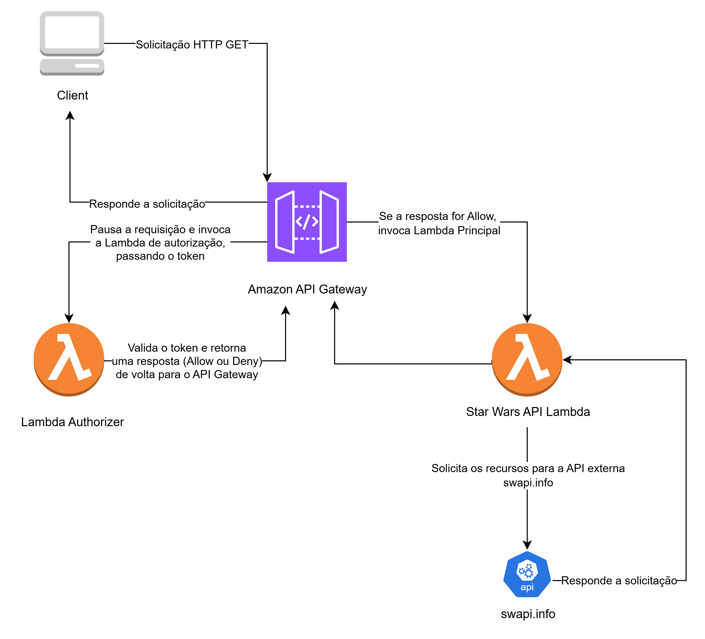

# API Star Wars - Desafio Técnico PowerOfData


API RESTful serverless construída na AWS para consultar informações do universo Star Wars, desenvolvida como parte do processo seletivo para Desenvolvedor Back End Júnior na PowerOfData.

---

## 🏛️ Arquitetura da Solução

A solução utiliza uma arquitetura serverless na AWS, garantindo escalabilidade, segurança e baixo custo. O fluxo da aplicação é descrito abaixo:

1. **Amazon API Gateway**: Atua como ponto de entrada, recebendo todas as requisições HTTP.
2. **Autorizador Lambda**: Valida tokens JWT enviados no cabeçalho `Authorization`.
3. **Função Lambda Principal**: Processa a lógica de negócio, consultando a **SWAPI (API externa)** e retornando respostas formatadas.

()

---

## ✨ Funcionalidades Principais

- **Endpoints Completos**: Rotas para consultar Personagens, Filmes, Planetas, Naves e Veículos.
- **Rotas Aninhadas**: Suporte a consultas de recursos correlacionados (ex.: personagens de um filme específico).
- **Filtragem e Ordenação**: Parâmetros de query para filtrar por nome e ordenar resultados por múltiplos campos.
- **Arquitetura Orientada a Objetos**: Código modularizado com classes `Handlers` que herdam de `BaseHandler`, facilitando manutenção e reuso.
- **Segurança com JWT**: Autenticação via token JWT, validada por um Autorizador Lambda no API Gateway.
- **Testes Unitários**: Testes com `pytest` e `unittest.mock` para validar lógicas de negócio de forma isolada.

---

## 🚀 Como Usar a API

### Autenticação

Todas as rotas são protegidas e exigem um token JWT válido. Para gerar um token de teste, clone o repositório e execute:

```bash
python generate_token.py
```

Inclua o token gerado no cabeçalho das requisições:

```
Authorization: Bearer [COLE O TOKEN GERADO AQUI]
```

### Endpoint Base

```
https://6kxkyjyby9.execute-api.us-east-2.amazonaws.com/default/
```

### Endpoints Disponíveis

| Método | Endpoint               | Descrição                                      | Exemplo de Chamada (curl)                                                             |
| ------ | ---------------------- | ---------------------------------------------- | ------------------------------------------------------------------------------------- |
| GET    | /people                | Lista os personagens da saga.                  | `curl -H "Authorization: Bearer $TOKEN" [URL_BASE]/people`                            |
| GET    | /films                 | Lista os filmes, ordenados por episódio.       | `curl -H "Authorization: Bearer $TOKEN" [URL_BASE]/films`                             |
| GET    | /films/{id}            | Retorna detalhes do filme com ID especificado. | `curl -H "Authorization: Bearer $TOKEN" [URL_BASE]/films/1`                           |
| GET    | /films/{id}/characters | Lista personagens de um filme específico.      | `curl -H "Authorization: Bearer $TOKEN" [URL_BASE]/films/1/characters`                |
| GET    | /starships             | Lista as naves estelares.                      | `curl -H "Authorization: Bearer $TOKEN" [URL_BASE]/starships?sort_by=cost_in_credits` |
| GET    | /vehicles              | Lista os veículos.                             | `curl -H "Authorization: Bearer $TOKEN" [URL_BASE]/vehicles`                          |
| GET    | /planets               | Lista os planetas.                             | `curl -H "Authorization: Bearer $TOKEN" [URL_BASE]/planets`                           |

### Parâmetros Opcionais (Query)

| Endpoint                 | Filtros Disponíveis                              | Ordenação Disponível                                                                                                      | Ordem         |
| ------------------------ | ------------------------------------------------ | ------------------------------------------------------------------------------------------------------------------------- | ------------- |
| `/people`                | `name`                                           | `name`, `height`, `mass`                                                                                                  | `asc`, `desc` |
| `/films`                 | `title`, `episode_id`, `director`, `producer`    | `title`, `episode_id`, `release_date`, `director`, `producer`                                                             | `asc`, `desc` |
| `/films/{id}`            | -                                                | -                                                                                                                         | -             |
| `/films/{id}/characters` | -                                                | -                                                                                                                         | -             |
| `/starships`             | `name`, `model`, `manufacturer`                  | `name`, `model`, `manufacturer`, `cost_in_credits`, `cargo_capacity`, `length`, `crew`, `passengers`, `hyperdrive_rating` | `asc`, `desc` |
| `/vehicles`              | `name`, `model`, `manufacturer`, `vehicle_class` | `name`, `model`, `cost_in_credits`, `length`, `crew`, `passengers`, `cargo_capacity`, `max_atmosphering_speed`            | `asc`, `desc` |
| `/planets`               | `name`, `climate`, `terrain`                     | `name`, `rotation_period`, `orbital_period`, `diameter`, `climate`, `gravity`, `terrain`                                  | `asc`, `desc` |

---

## 🛠️ Executando os Testes Localmente

O projeto utiliza `pytest` para testes unitários. Para executá-los, siga os passos:

1. Instale as dependências:

```bash
pip install -r src/starwars_api/requirements.txt
pip install -r tests/requirements.txt
```

2. Execute os testes:

```bash
pytest tests/
```

---

## 🚀 Próximos Passos e Melhorias

- **Sistema de Contas de Usuário**: Implementar microsserviço com rotas `/register` e `/login`, utilizando Amazon DynamoDB para gerenciar contas e dados personalizados (ex.: lista de favoritos).
- **CI/CD**: Automatizar deploy com GitHub Actions, garantindo execução de testes e implantação segura na AWS.

---
